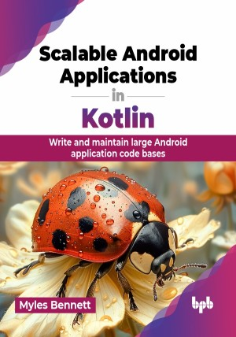

# Scalable Android Applications in Kotlin

Write and maintain large Android application code bases.

This is the repository for [Scalable Android Applications in Kotlin
](https://bpbonline.com/products/scalable-android-applications-in-kotlin?variant=44126084792520),published by BPB Publications.

## About the Book
Kotlin, a modern and expressive language, has revolutionized Android app development. As the app complexity grows, building scalable and maintainable Android apps becomes crucial. 

This book is a complete guide to modern Android app development using Kotlin. It covers key concepts like clean architecture and dependency injection for building strong, maintainable apps. This book will also help you learn how to use Kotlin DSL for build configuration and Jetpack Compose for creating user interfaces. It also covers testing, debugging, networking, and API integration. With best practices and real-world examples, this book will help developers create high-quality Android apps using Kotlin.

By the end of this book, you will be equipped with the knowledge and skills to architect, develop, and deploy scalable Android apps using Kotlin. You will confidently tackle complex app development challenges, write clean, efficient, and testable code, and become a proficient Android developer.

## What You Will Learn
• Kotlin and Jetpack Compose fundamentals.

• Feature-oriented separation of concerns.

• Clean-code architecture in Android.

• Kotlin-specific test-driven development.

• Multi-module project organization.

• Tips and techniques for debugging.

• Continuous integration and releasing applications.
